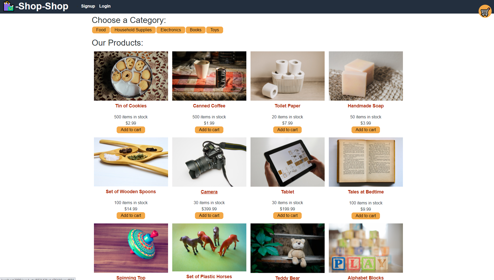
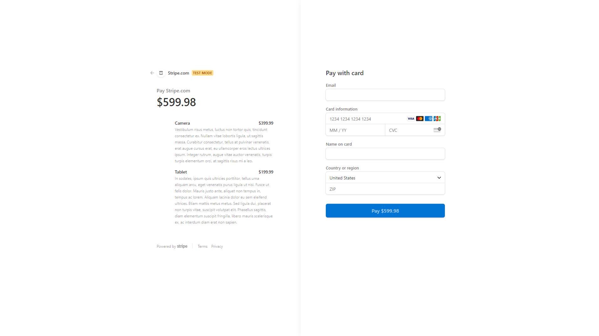

# Shop Shop

## Description

Shop Shop is an ecommerce application that the user can use to buy many different products. When the product is clicked on the user can see a larger picture and description of the product. The user can also add and remove products from their cart which persists from online to offline. Once the user logs in then they can checkout, which redirects them to a Stripe page where they can input the required information and purchase the products.

## Table of Contents

- [Installation](#installation)
- [Usage](#usage)
- [License](#license)
- [Contributing](#contributing)
- [Questions](#questions)

## Installation

Go to https://protected-springs-85936.herokuapp.com/ to use the web application.

## Usage

First signup or login, then add the products that you want. Next hit the checkout button and file in the buying information. After buying the products the user can see order history on the main web page and that will show previous orders.

## License

[MIT](https://opensource.org/licenses/MIT)

## Contributing

No contributions at this time.

## Questions

- Contact me on [Github](http://www.github.com/DuncanMarten)
- Contact me by [email](mailto:duncanmarten@yahoo.com)
